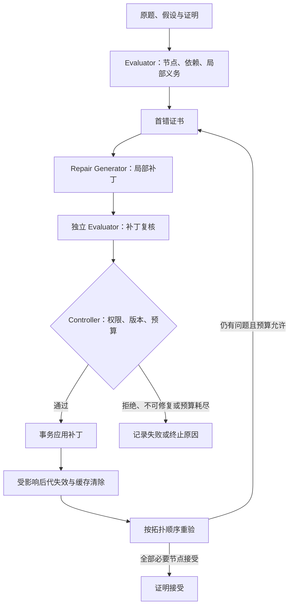

# 论文材料入口

- [中文初稿](why_repair_engineering_paper_draft_zh.md)
- [证据台账](ARTICLE_EVIDENCE_LEDGER_2026-09-10.md)
- [从源报告重建的结果总表](generated/results.md)
- [十个历史代表案例与原始补丁](generated/case_cards.md)
- [数据与输出哈希](generated/manifest.json)
- [真实消融运行器的缺口](ABLATION_READINESS.md)
- [系统卡](../SYSTEM_CARD.md)
- [最小人工终审包](../human_review/MINIMUM_FINAL_REVIEW_2026-09-11.md)

运行 `python scripts/build_paper_evidence.py` 重建总表、案例和清单。此命令不调用模型，不增加人工审核记录。环境安装使用 `python -m pip install -r requirements.txt`，工程测试使用 `python -m unittest discover -s tests`。

## 架构图

角色图表示实现的协议；不能以图示推定九方法模型实验已经执行这些步骤。

历史 50 题记录包含两个不同的审核分片角色。当前减少到 Person B 的人工安排适用于后续工作；论文仍应如实交代历史记录，不能将整个历史称为一个人完成或双人独立盲审。
