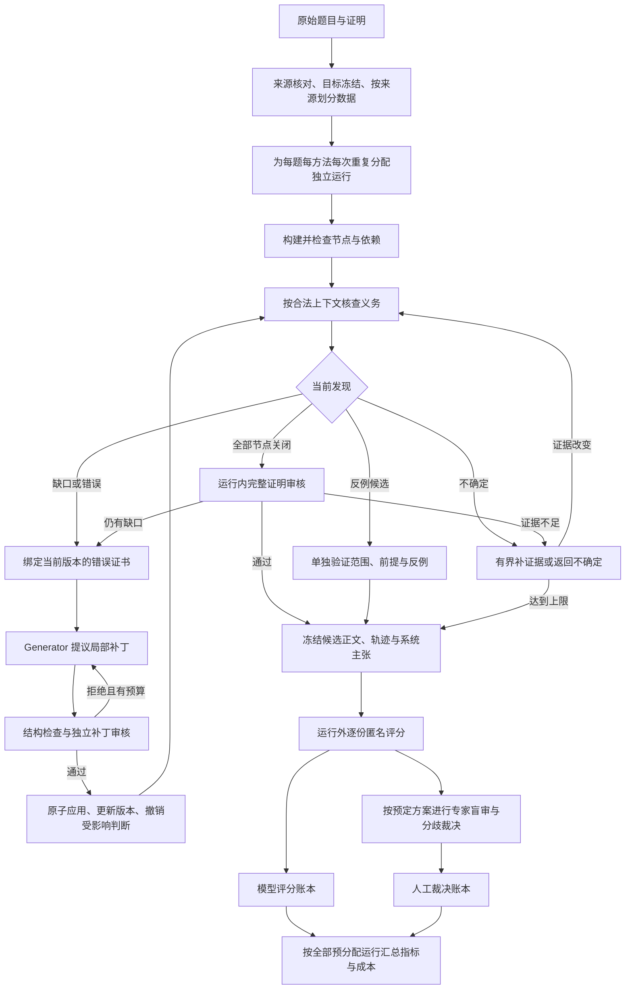

# Why-Repair v2：证明修复、实验与验收工作流程

设计日期：2026-09-12。S1–S3 已实现并通过离线验证；S4 已完成第二轮 108 项端到端先导、18 项受控机制实验及 18 项补充回归，均有有效 Astra 评分。真实人工校准与正式测试冻结尚未完成。见 [运行结果与证据](LATEST_RUN.md)及[常驻服务调度器](SCHEDULER.md)，各数据包的实际状态以 `scheduler/final.json` 为准。

本目录是后续 v2 开发的入口。历史 M0–M8 协议、结果及运行器保留各自版本和适用范围；本设计不追溯修改其结果或将其升级为新的证据。

- [接口与验收契约](contracts.md)
- [机器可读设计配置](protocol.json)
- [角色提示词规格](prompts.md)
- [实施顺序与验收任务](implementation_plan.md)
- [实验前交接与已验证范围](PRE_EXPERIMENT_HANDOFF.md)
- [常驻服务调度、监督与运行记录](SCHEDULER.md)
- [最新结果、成本与结论边界](LATEST_RUN.md)
- [人工校准材料与规则](JUDGE_CALIBRATION.md)
- [机制实验设计与结果](MECHANISM_STRESS.md)
- [正式实验方案草案](FORMAL_STUDY_DRAFT.md)

当前可执行入口为 `scripts/run_workflow_v2.py`，实现位于 `harness/workflow_v2/`，模型输出 Schema 位于 `schemas/workflow_v2/`。已完成两轮开发先导、受控机制实验及针对性回归；正式新测试集和专家校准尚未完成。`protocol.json` 的阶段状态是准备时的设计快照，实时完成状态见运行记录。

## 1. 研究目标与设计选择

目标：在不改变原命题、假设、定义域和子问题目标的前提下，修复自然语言证明，并说明每个接受判断依据的是哪个版本和哪份证据。

主问题：依赖重验是否降低虚假成功率；相比每轮全篇重验是否节约成本；这些效果如何受到图质量、错误类型及依赖结构影响。修复覆盖率和正确证明破坏率必须同时报告，不能通过大量拒答制造低错误率。

本设计的关键选择：

1. 运行内 Evaluator 为修复提供反馈；运行外 Judge 只评分冻结输出。两者使用独立会话、输入白名单和记录，外部评分不得回流同一实验运行。
2. Controller 管理结构和状态，不作数学裁决。角色分离不等于模型错误独立，更不等于人工审核。
3. `gap`、`invalid`、`undetermined` 分开处理；缺少可用修复与命题为假分开处理。
4. Graph Builder、诊断、生成、审核和重验必须有真实阶段调用或可追溯的确定性计算；角色名或提示词中的流程描述不是执行证据。
5. 局部审核通过后先进入重验；运行内完整证明审核通过后仅标记候选就绪。最终实验指标由独立评分账本计算。
6. `minimal` 改为可度量的修改范围与约束内局部性；不把模型声称“每个修改都不可删除”当成全局最小性证明。

### 固定模型配置

按项目所有者要求，工程先导、正式实验及组件消融统一写死以下配置：

| 用途 | 请求模型 ID | reasoning_effort | 覆盖范围 |
|---|---|---|---|
| 实验模型 | `gpt-5.6-sol` | `xhigh` | 各方法运行内的构图、诊断、生成、自检、Critic、补丁审核、反例核验、重验、全文审核及候选选择 |
| 独立验证模型 | `gpt-6-astra` | `high` | 运行外逐份匿名评分 |

配置不是可覆盖的默认值；v2 运行器拒绝命令行或环境变量改写模型/推理强度，并关闭自动降级和替代模型。指定模型不可用时保留失败记录。模型 ID 是固定请求值，后端实际模型名/快照仍根据返回记录核实；不可见时保留未知。模型校准用于测量裁判误差与调整评分规则，不再选择模型或推理强度。

## 2. 当前实现的处理决定

核对的基线：本地 `ba3e860e4977db6de047c0cb9f1a3f26581ed4cb`，远端主干 `8221202191aebb06ffe0bb887d69173051dc364c`；实验 1 分支 `5ff3ded1567b153d91d9795860a4b1eeadbbba70`；实验 2 分支 `7181b56cdbaceb55d111b850d7a46fc58e15c775`。

| 现状 | v2 决定 |
|---|---|
| M5 Controller 已有节点版本、原子应用、后代失效、拓扑重验 | 复用概念和测试；在独立 v2 接口中补齐状态与最终验收，不修改旧结果语义 |
| M6 从已有 M3 文件读取证明图 | 端到端实验从原始文本构图；已有图只用于独立的机制实验，并标明来源 |
| M6 诊断不为 invalid 就停止 | 完备性检查也可生成缺口义务；不确定进入有界补证据流程 |
| 600 题同一调用生成四种方法的答案 | 归档为联合生成的提示条件比较；不迁移为 v2 方法或组件运行 |
| 实验 2 从同一批候选导入评分 | 标明共享证据，不算独立重复实验 |
| 600 题 Judge 同时看到原证明和四候选，带 claimed_outcome，漏传 domain | 每份证明独立请求；只传原题上下文与匿名正文，显式传 domain |
| 缓存可能按结果文件是否存在跳过运行 | 必须核对完整输入、模型配置、代码及输出摘要，不能按存在性判定完成 |
| `accepted` / `irreparable` 混合过程与数学结论 | 采用互不覆盖的运行终态、系统主张、外部裁判结果和人工证据等级 |

## 3. 总体流程

图中的反例与不确定路径也保留不同终态，不能以“已冻结输出”计为修复成功。预算耗尽、输入错误和运行异常从任意阶段进入各自终态，保留最后可重建的正文和全部失败记录。

## 4. 数据准备与上下文冻结

输入为 `theorem + assumptions + domain + proof_text + explicit_subgoals`，保存逐字原文及摘要。先核对是否缺页、截断、缺定义或未提供子问题；确有输入缺失时返回 `input_invalid`，不能自行补成容易证明的命题。

语义层分成三个彼此独立的维度：

- 命题状态：`true / false / unknown`，带证据来源；不从原证明是否正确推断。
- 原证明状态：`valid / gap / invalid / undetermined`。
- 局部修复适用性：在指定操作和预算下 `eligible / ineligible / unknown`；这是方法范围，不是不可证明定理。

所有原始 Gold、人工备注、参考证明、错误注入信息、已有模型结果保存在评分侧。模型输入由字段白名单重新构造，不能传整行后依赖提示词要求忽略 Gold。

数据按原始定理/来源家族分组，再划分开发、评分校准和测试集；相同题目的改写及错误变体不得跨组。现有 600 题已被研究过程查看，只能用于开发或明确披露的回顾性测试。确认性结论需要新冻结且不用于调参的测试集；重新命名旧题不构成未见测试。

## 5. 证明图与局部义务

Graph Builder 可以看到全篇原证明以恢复引用，但其输出只是待核验的表示。每个节点保存源文本范围、原始语句、展开后的自包含命题、量词和假设作用域、直接依赖及最终目标映射。

程序检查覆盖、引用存在性、唯一 ID、顺序、无环、作用域和目标映射；数学语义缺失仍需评估，不能由 DAG 合法推出图完整。图不确定时有界重建；仍无法确定则记录 `graph_uncertain`，采用保守的后缀失效和全篇审核，成本计入该方法。

Evaluator 按拓扑前沿工作。局部可用证据仅含原题事实、作用域合法且当前已关闭的前驱、已核验规则。`gap`、`invalid`、`undetermined` 节点均不得提升为可信前提；依赖它们的节点标记 `blocked`。

确定性精确计算和已验证反例优先；否则检索冻结定理库，并逐项核对适用条件。检索命中、证明图标签、模型自信和未找到反例均不能关闭义务。测试阶段不开放不受控网页检索；需要新资料的情况记为不确定，或进入事先独立定义的开放工具实验。

对每个未关闭且未被上游阻塞的节点，诊断必须指出具体失败推理边，并区分 `confirmed / false_positive / uncertain`。只有确认的缺口或错误产生修复证书。全文完整性检查发现遗漏目标时，建立显式的目标义务，不把“现有所有节点通过”当成完成。

## 6. 修复、反例和不确定性的不同路径

**补丁路径。** Generator 读取冻结问题、当前证书、目标节点、合法前驱和修改边界，只提议一个操作；不能读取测试 Gold、其他方法候选、外部评分或隐藏推理。允许操作包括替换、在前方插入引理、受控删除和显式依赖修正。缺失结论可在证书明确标明的目标位置插入，不能更改冻结目标。

独立审核验证补丁是否解决证书中的问题、保持原题、无新增假设且引用合法。Controller 先在临时状态中验证结构，再原子应用；失败时恢复完整状态。正确性与修改范围分开评分，未证明全局最小性不会自动否定一个正确修复。

删除节点不得删除最终目标或使其依赖悬空；不能简单地把旧前驱接到下游便视为语义等价。依赖边改变也必须审核与重验。

**反例路径。** 模型只能提出 `counterexample_candidate`。另一次调用或确定性工具验证每条原假设与被否定的目标；局部节点反例只否定该节点，不能升级为原命题为假。未通过验证的候选回到错误/不确定路径。经运行内确认的全局反例形成 `counterexample_ready`，仍需运行外独立判断；反例成功不计入证明修复成功。

**不确定路径。** 允许一次有界的上下文检查、规则条件核对或工具验证；没有新证据即停止为 `undetermined`。不得把“再问一次直到得到肯定”用作裁决策略，不能把不确定自动编造成确定错误证书。

## 7. 失效、缓存与重新验收

每份 EvaluationRecord 绑定完整上下文指纹：问题、节点内容/版本、作用域、直接依赖及其传递有效指纹、规则库、检查器、模型配置、提示词和工具结果。配置未知或变化时禁用相关缓存。

一次补丁后的保守失效集合为：

`changed_nodes ∪ descendants_before(changed_nodes) ∪ descendants_after(changed_nodes)`。

作用域或 ambient facts 改变时还须扩展到受影响作用域；无法确定范围则全篇失效。实际闭包的计算必须保留旧图和新图，避免删除依赖边后漏掉旧后代。

节点重验按新的拓扑顺序进行；前驱未关闭时后代保持阻塞。图边在后续审核中补充时重新计算失效集合。独立分支的旧判断只有在完整指纹完全相同时才可复用。

全部局部义务关闭后，运行内 Final Auditor 从冻结原题和重建的全文重新检查正确性、作用域、目标完整性及问题保持；不读取原有肯定判词。其成本计入方法预算。审核发现问题可以进入新一轮修复；达到预算上限仍未通过则不能产生成功主张。

该审核与运行外评分是两次不同的调用。所有方法都接受同样的运行外评分，评分成本单列，不能把外部裁判作为完整系统的免费反馈。

## 8. 运行外评分与人工核验

评分请求只包含随机匿名 `sample_id`、原命题、原假设、定义域、显式子目标及一份候选正文。原证明也以相同方式匿名提交。原题 ID、方法名、生成模型、图、证书、系统主张、其他候选、参考答案和旧判词全部移除。

一份候选一次独立评分会话。证明和反例使用同一通用指令，由裁判先识别正文类型，再判断。`validity`、`rigor`、`problem_preservation`、`goal_coverage` 均为三值而非强制布尔；输出具体问题位置、简短数学理由及工具证据范围，不要求隐藏思维链。

严格模型接受由程序计算：正文类型为证明、数学有效、严谨性通过、问题保持通过、全部目标覆盖且无未解决义务。反例另算；`unknown` 一律不能计为接受。裁判异常记入评分缺失，不得伪装成数学否定或从分母消失。

裁判固定使用 `gpt-6-astra` / `high`，先在开发之外的人工确认校准集上测量误接受、误拒绝和不确定率。评分规则与提示词调整只在校准阶段进行，测试评分前冻结；不更换模型或推理强度，不根据测试结果选择较有利的裁判。

人工盲审按预定来源/原证明状态/系统成功主张/方法分歧分层抽样，保留入样概率；可额外全审高风险案例，但推断总体时使用正确权重。理想流程是两名实际独立审核者先各自判断，再由第三人处理分歧；只有一人时如实报告单人核验，不能填第二个角色名充当独立审核。人力未到位时可以完成模型实验并报告其结果，但人工验证状态保持待完成。

## 9. 两组实验与预算

### 9.1 端到端方法比较

各方法从相同原始文本独立运行，不能共享生成结果、诊断或模型缓存。

| 方法 ID | 实际执行定义 |
|---|---|
| `original` | 原文不变，只作独立外部评分参照 |
| `direct_rewrite` | 一次真实调用输出完整修复证明 |
| `self_refine` | 初稿 → 单独反馈调用 → 单独修订调用；同一基础模型，保存各轮产物 |
| `generator_critic` | 生成 → 独立 Critic → 修订；无图版本控制的完整文本迭代 |
| `best_of_n` | 独立生成 n 个完整候选，内部匿名选择一个；生成与选择均计费，不能用测试裁判挑选 |
| `full_system` | 本文定义的构图、诊断、局部补丁、版本控制、依赖重验与运行内全文审核 |

所有可比较修复方法统一使用 `gpt-5.6-sol` / `xhigh`、相同工具条件和预算上限，统计实际用量；一次改写可以自然提前结束，不为耗尽预算重复调用。本轮不增加第二个实验模型，结论范围限定为这一固定模型配置。运行外使用 `gpt-6-astra` / `high` 评分不构成跨实验模型复现。

### 9.2 机制与组件实验

机制实验使用相同的已核对初始图和诊断，作为公开实验条件提供给全部配置；单独标记 `verified_graph_mechanism`，不计入端到端性能。构图与标注成本另外报告。

完整配置只改变以下一个因素：

- `plain_certificate`：保留相同诊断信息，用自然语言表示；目标路由元数据由 Controller 保留。
- `no_counterexample_search`：关闭显式反例搜索；仍核验自发出现的反例，保持原题约束。
- `no_descendant_revalidation`：隔离实验中故意保留过期后代判断，记录每次复用；不能用作默认运行流程。
- `full_revalidation`：每次应用补丁后重验全部义务。
- `single_round`：只允许一轮生成尝试，其他条件不变。
- `no_internal_final_audit`：移除运行内全篇审核，运行外评分保持完全一致。

另做独立的图漏边/错边扰动实验，披露扰动位置和强度；不将多处变化称为单组件消融。比较失效策略时同时观察外部验收前的错误成功主张和最终输出质量，避免最终全篇审核掩盖中间机制问题。

### 9.3 预算与运行记录

`protocol.json` 中数值仅为工程先导候选：每任务最多 24 次模型尝试、80,000 个总 token、1,800 秒、3 次补丁尝试、最多 2 个新增节点/补丁、6 个总节点编辑、1 次不确定性补证据；Best-of-n 的 n 为 3。先导后按成本和图规模冻结正式预算，不能声称这些数值由功效分析得出。

所有构图、诊断、反馈、审核、重验、内部选择与失败重试都计入方法预算。工具调用单列次数与时间；重试不能免费。预算至少同时报告输入/输出/推理 token（如供应方可见）、实际工具成本和墙钟时间；缺失用量记未知，不能记零。不能硬限制 token 的适配器要如实标为软限制，保留超额输出并按预定规则停止，不能删掉费用。

任务唯一键为 `run_id / source_group / case_id / method_id / model_config_hash / replicate`。随机种子支持情况如实记录；哈希打乱顺序不算随机模型重复。每个方法会话隔离，复用仅限同一任务完全匹配的请求。

## 10. 指标、统计和结论边界

所有任务预分配，运行失败、预算耗尽、不确定及评分缺失都有独立列。不得只在完成或成功的案例上计算修复率。

| 指标 | 分母与解释 |
|---|---|
| 修复成功率 | 人工/可靠证据确认命题可成立且原证明有缺陷的所有预分配题；模型评分与人工核验分别给出 |
| 总体严格接受率 | 全部预分配题；是混合队列描述指标，不冒充修复成功率 |
| 虚假成功率 | 系统声称成功的任务；外部否定为错误，不确定和评分缺失另列并给保守界 |
| 成功覆盖率 | 系统声称成功的任务 / 全部预分配任务 |
| 正确证明破坏率 | 原证明经可靠核验正确的任务；系统输出变错、弃权或失败分开报告 |
| 反例识别与验证率 | 命题经可靠证据确认为假的任务；未能局部修复不能作为分母标签 |
| 机制指标 | 过期判断复用、重验发现新错误、局部通过但全局失败、图缺失漏检 |
| 成本与局部性 | 每个分配任务及每个成功任务的总费用/时间、节点编辑数、正文变化量 |

若系统声称成功数为 S，独立审核确认错误 F、未解决 U（包括缺评），则虚假成功率报告区间 `[F/S, (F+U)/S]`；S=0 时记未定义，不能记零。抽样人工核验用入样概率加权估计，不能把抽审结果直接套到这个全审公式。

主比较、分层、预算档和统计方法在测试前冻结。按源定理家族聚类的配对 bootstrap 报告差值区间；单次配对二元终点可用 McNemar，预定多重比较采用 Holm。多次模型重复不得当作独立新题扩充样本量。工程先导用于估计变异和后续样本规模，不强行追求显著性。

## 11. 完成定义与实施入口

设计完成：本目录的流程、接口、方法定义、指标及实施任务互相一致。运行器完成：真实阶段轨迹通过实施计划中的语义验收。模型实验完成：所有分配任务和外部评分都有可解释终态。人工核验完成：存在真实审核者的原始独立记录。论文结论成立：其适用范围和强度不超过以上证据。

下一步开发按 [implementation_plan.md](implementation_plan.md) 顺序进行。常规实现、离线测试和证据准备不需要新增项目级签字；已有任务授权和环境限制继续适用。缺少人工审核只限制人工验证声明，不自动阻塞全部工程工作。
